# AWS Services Fundamentals

Use this map to learn AWS by capability instead of memorizing an unstructured
list of services.

```mermaid
flowchart TD
  AWS[AWS Fundamentals]

  AWS --> GI[Global Infrastructure]
  AWS --> SEC[Security, Identity, and Governance]
  AWS --> NET[Networking and Content Delivery]
  AWS --> CMP[Compute and Containers]
  AWS --> STO[Storage]
  AWS --> DB[Databases and Caching]
  AWS --> ANA[Analytics]
  AWS --> INT[Application Integration]
  AWS --> OPS[Management and Observability]
  AWS --> MIG[Migration and Transfer]

  GI --> Region[Regions]
  GI --> AZ[Availability Zones]
  GI --> Edge[Points of Presence]

  SEC --> IAM[AWS IAM]
  SEC --> KMS[AWS KMS]
  SEC --> Cognito[Amazon Cognito]
  SEC --> WAF[AWS WAF]
  SEC --> Organizations[AWS Organizations]

  NET --> VPC[Amazon VPC]
  NET --> Route53[Amazon Route 53]
  NET --> CloudFront[Amazon CloudFront]
  NET --> ELB[Elastic Load Balancing]
  NET --> DirectConnect[AWS Direct Connect]

  CMP --> EC2[Amazon EC2]
  CMP --> Lambda[AWS Lambda]
  CMP --> ECS[Amazon ECS]
  CMP --> EKS[Amazon EKS]
  CMP --> Beanstalk[AWS Elastic Beanstalk]

  STO --> S3[Amazon S3]
  STO --> EBS[Amazon EBS]
  STO --> EFS[Amazon EFS]
  STO --> Glacier[S3 Glacier storage classes]

  DB --> RDS[Amazon RDS]
  DB --> Aurora[Amazon Aurora]
  DB --> DynamoDB[Amazon DynamoDB]
  DB --> ElastiCache[Amazon ElastiCache]

  ANA --> Redshift[Amazon Redshift]
  ANA --> Athena[Amazon Athena]
  ANA --> Glue[AWS Glue]
  ANA --> Kinesis[Amazon Kinesis]

  INT --> SQS[Amazon SQS]
  INT --> SNS[Amazon SNS]
  INT --> EventBridge[Amazon EventBridge]
  INT --> StepFunctions[AWS Step Functions]

  OPS --> CloudWatch[Amazon CloudWatch]
  OPS --> CloudTrail[AWS CloudTrail]
  OPS --> Config[AWS Config]
  OPS --> SystemsManager[AWS Systems Manager]
  OPS --> CloudFormation[AWS CloudFormation]

  MIG --> MGN[AWS Application Migration Service]
  MIG --> DMS[AWS Database Migration Service]
  MIG --> DataSync[AWS DataSync]
  MIG --> Transfer[AWS Transfer Family]

  classDef root fill:#232f3e,color:#fff,stroke:#232f3e
  classDef category fill:#ff9900,color:#111,stroke:#cc7a00
  class AWS root
  class GI,SEC,NET,CMP,STO,DB,ANA,INT,OPS,MIG category
```

## Core Mental Models

| Concept | What to remember |
|---|---|
| Region | A separate geographic area containing multiple Availability Zones. Choose based on latency, compliance, service availability, and cost. |
| Availability Zone | One or more discrete data centers with independent power, networking, and connectivity. Use multiple AZs for high availability. |
| Point of Presence | An edge site used by services such as CloudFront and Route 53 to serve users closer to their location. |
| Shared responsibility | AWS secures the cloud; customers secure their workloads and data in the cloud. The exact boundary depends on the service type. |
| High availability | Remove single points of failure and distribute workloads across fault-isolated locations, usually multiple AZs. |
| Elasticity | Add or remove resources as demand changes. |
| Least privilege | Grant only the permissions required, for only as long as required. |

## Service Selection Shortcuts

| Requirement | Start with |
|---|---|
| Virtual machines with operating-system control | Amazon EC2 |
| Event-driven code without server management | AWS Lambda |
| Object storage, static assets, or data lakes | Amazon S3 |
| Block storage for an EC2 instance | Amazon EBS |
| Shared POSIX file storage | Amazon EFS |
| Managed relational database | Amazon RDS or Amazon Aurora |
| Serverless key-value and document database | Amazon DynamoDB |
| Data warehouse and SQL analytics at scale | Amazon Redshift |
| Queue-based decoupling | Amazon SQS |
| Pub/sub notifications | Amazon SNS |
| Event routing between applications and AWS services | Amazon EventBridge |
| Metrics, logs, alarms, and dashboards | Amazon CloudWatch |
| API activity and account audit history | AWS CloudTrail |
| Resource configuration history and compliance rules | AWS Config |

## Review Questions

1. Which services are Regional, and which use a global control plane or edge
   network?
2. When should a workload use multiple Availability Zones instead of multiple
   Regions?
3. How do security groups differ from network ACLs?
4. When is S3 preferable to EBS or EFS?
5. How do SQS, SNS, and EventBridge solve different integration problems?
6. Which service records API activity, and which service collects operational
   metrics and logs?

## Official References

- [AWS Global Infrastructure](https://aws.amazon.com/about-aws/global-infrastructure/)
- [AWS Architecture Center](https://aws.amazon.com/architecture/)
- [AWS Well-Architected Framework](https://docs.aws.amazon.com/wellarchitected/latest/framework/welcome.html)
- [AWS Shared Responsibility Model](https://aws.amazon.com/compliance/shared-responsibility-model/)
