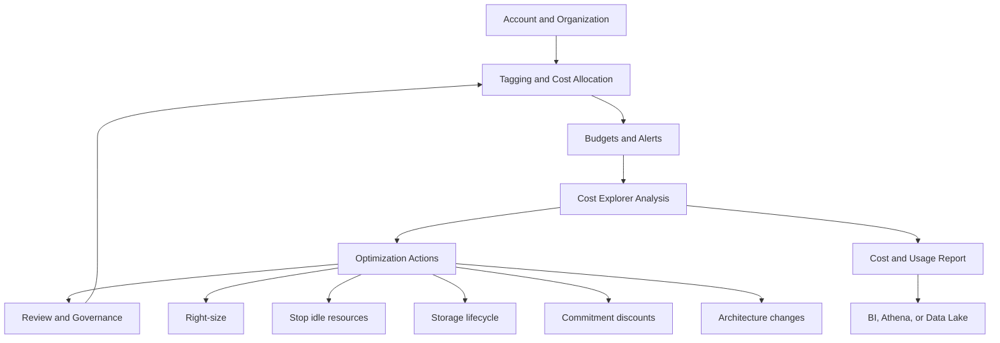
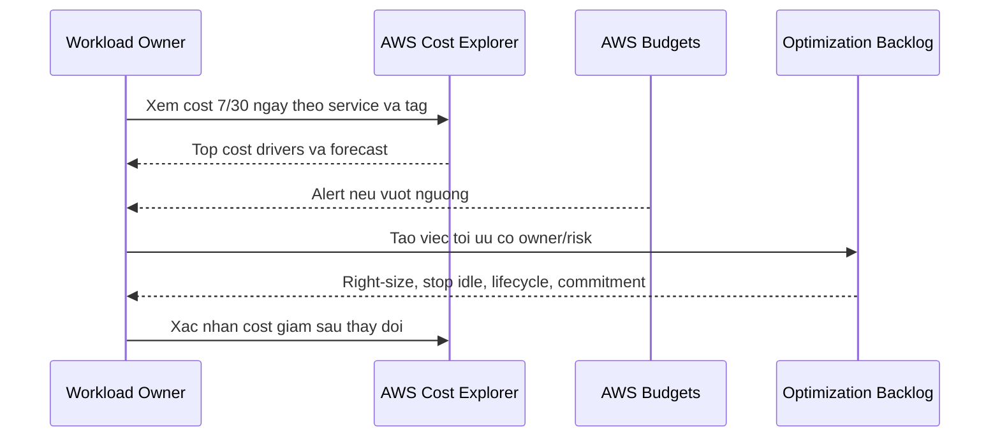

# AWS Cost Management Guideline

Tai lieu nay dung nhu mot checklist thuc hanh de quan ly chi phi AWS tu luc
bat dau hoc, lab, den khi chay workload production. Muc tieu khong phai la
"cat het chi phi", ma la biet tien dang di dau, canh bao som, va toi uu co
kiem soat.

## Mental Model



## Setup Ngay Tu Dau

1. Bat AWS Billing alerts va tao AWS Budgets cho tung moi truong.
2. Dung AWS Cost Explorer de xem cost theo service, region, account, tag.
3. Bat Cost Anomaly Detection de nhan canh bao khi chi phi tang bat thuong.
4. Dinh nghia tag bat buoc cho moi resource: `Project`, `Environment`,
   `Owner`, `CostCenter`, `ManagedBy`.
5. Kich hoat cost allocation tags trong Billing console sau khi gan tag.
6. Neu co nhieu account, dung AWS Organizations de gom bill va phan quyen theo
   account: `dev`, `staging`, `prod`, `shared-services`, `security`.

## Tagging Standard

| Tag | Vi du | Muc dich |
|---|---|---|
| `Project` | `worldmonitor` | Gom chi phi theo san pham/ung dung |
| `Environment` | `dev`, `staging`, `prod` | Tach lab/test khoi production |
| `Owner` | `team-data` | Biet ai chiu trach nhiem |
| `CostCenter` | `ai-platform` | Phan bo chi phi noi bo |
| `ManagedBy` | `terraform`, `manual`, `cdk` | Tim resource tao thu cong |

Best practice:

- Khong de resource production khong co tag.
- Dung AWS Config, IaC policy, hoac CI check de chan resource thieu tag.
- Dat ten resource co ngu nghia, vi tag khong phai luc nao cung hien ro trong
  log, alert, hoac man hinh van hanh.

## Budget Va Alert

Nen tao it nhat 4 loai budget:

| Budget | Muc dich | Nguong goi y |
|---|---|---|
| Monthly account budget | Chan tong bill vuot tam kiem soat | 50%, 80%, 100% |
| Service budget | Bat service dat tien nhu EC2, NAT Gateway, Bedrock | 70%, 90%, 100% |
| Environment budget | Tach `dev`/`prod` | Theo tag `Environment` |
| Usage budget | Canh bao usage nhu EC2 hours, token, data transfer | Theo don vi usage |

Canh bao nen gui ve email, Slack/SNS, hoac ticketing system. Voi account hoc
tap ca nhan, dat budget thap va alert som de tranh bat ngo.

## Quy Trinh Review Hang Tuan



Checklist review:

- Service nao tang nhanh nhat trong 7 ngay gan day?
- Region nao dang phat sinh chi phi khong mong muon?
- Resource nao khong co tag?
- Chi phi `dev` co chay ngoai gio lam viec khong?
- Co NAT Gateway, EBS volume, snapshot, load balancer, IP public nao bi bo quen?
- Forecast cuoi thang co vuot budget khong?

## Toi Uu Theo Dich Vu

### EC2

- Dung instance dung kich thuoc; tranh chon instance lon ngay tu dau.
- Tat instance lab/dev ngoai gio lam viec bang scheduler.
- Dung Auto Scaling cho workload co tai bien dong.
- Xem Savings Plans hoac Reserved Instances khi workload on dinh.
- Kiem tra EBS volume khong attached va snapshot cu.

### S3

- Bat lifecycle policy: Standard -> Standard-IA/One Zone-IA -> Glacier neu du
  lieu it truy cap.
- Dung Intelligent-Tiering khi pattern truy cap kho du doan.
- Xoa multipart uploads chua hoan tat.
- Theo doi request cost neu ung dung doc/ghi qua nhieu object nho.

### RDS And Databases

- Chon dung engine va size; bat storage autoscaling co gioi han.
- Tat database dev ngoai gio neu duoc.
- Review backup retention, snapshot cu, read replica khong dung.
- Dung reserved capacity khi workload production on dinh.

### Lambda

- Toi uu memory theo latency va cost, khong chi giam memory mot cach may moc.
- Giam cold start bang cach cat dependency thua.
- Dung batch size hop ly voi SQS/Kinesis/EventBridge.
- Dat timeout sat thuc te de tranh invocation treo lau.

### Networking

- NAT Gateway co the dat tien neu data di qua nhieu; dung VPC endpoints cho S3,
  DynamoDB, ECR, CloudWatch neu phu hop.
- Tranh data transfer cross-AZ/cross-region khong can thiet.
- Xoa load balancer, Elastic IP, VPC endpoint khong dung.

### CloudWatch

- Dat retention cho log group, khong de mac dinh giu vo han.
- Giam log verbose o production, tach debug log bang feature flag.
- Theo doi custom metrics vi moi metric co the tao them chi phi.

### Amazon Bedrock

- Chon model theo nhu cau: task don gian khong can model lon nhat.
- Gioi han `max_tokens`, rut gon prompt, cat bot context khong can.
- Cache prompt/ket qua voi cau hoi lap lai neu duoc.
- Dung batch inference cho job offline khi latency khong quan trong.
- Theo doi input token, output token, latency, error va cost theo IAM principal,
  project, hoac tenant.

## Commitment Discounts

Dung commitment khi workload da on dinh:

| Lua chon | Phu hop khi |
|---|---|
| Savings Plans | Compute usage on dinh nhung co the thay doi instance family |
| Reserved Instances | RDS/EC2 pattern ro rang, it thay doi |
| Spot Instances | Batch, CI, worker co the retry |
| Provisioned capacity | Can latency/capacity on dinh, da co du lieu usage that |

Khong mua commitment chi vi muon "tiet kiem". Truoc tien can co du lieu usage,
forecast, va ke hoach van hanh.

## Governance

Nen ap dung cac guardrail sau:

- Dung IAM least privilege cho nguoi tao resource.
- Tach account theo moi truong de dev khong anh huong prod.
- Bat MFA cho root va admin users.
- Dung Service Control Policies neu co AWS Organizations.
- Bat CloudTrail de audit hanh dong tao/xoa/sua resource.
- Dung Infrastructure as Code de resource co owner, tag, va review.
- Dinh ky xoa resource tam sau lab.

## Cost Review Template

```text
Ky review:
Tong cost thang nay:
Forecast cuoi thang:
Top 5 services:
Top 5 resources/accounts/tags:
Anomaly:
Resource khong tag:
Hanh dong toi uu:
Owner:
Ngay kiem tra lai:
```

## Quick Checklist Cho Account Hoc Tap

- [ ] Tao monthly budget ngay sau khi tao account.
- [ ] Dat alert o 50%, 80%, 100%.
- [ ] Tat/xoa EC2, RDS, NAT Gateway, Load Balancer sau moi lab.
- [ ] Xoa EBS volume, snapshot, Elastic IP khong dung.
- [ ] Dat CloudWatch log retention.
- [ ] Review Cost Explorer moi tuan.
- [ ] Khong de access key/secrets trong repo.

## Official References

- [AWS Billing and Cost Management](https://docs.aws.amazon.com/cost-management/latest/userguide/what-is-costmanagement.html)
- [AWS Budgets](https://docs.aws.amazon.com/cost-management/latest/userguide/budgets-managing-costs.html)
- [AWS Cost Explorer](https://docs.aws.amazon.com/cost-management/latest/userguide/ce-what-is.html)
- [AWS Well-Architected Cost Optimization Pillar](https://docs.aws.amazon.com/wellarchitected/latest/cost-optimization-pillar/welcome.html)

