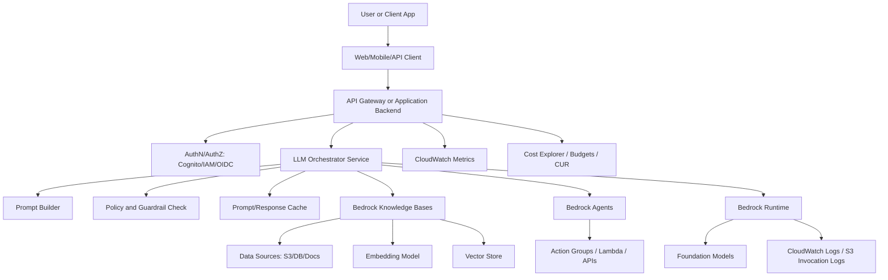
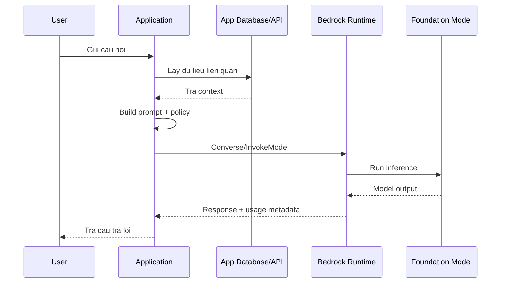
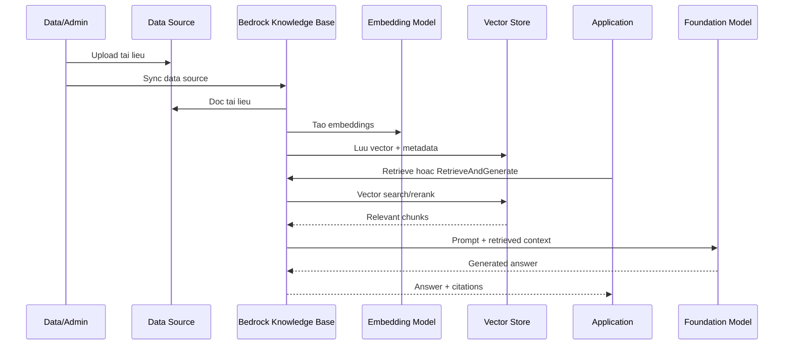
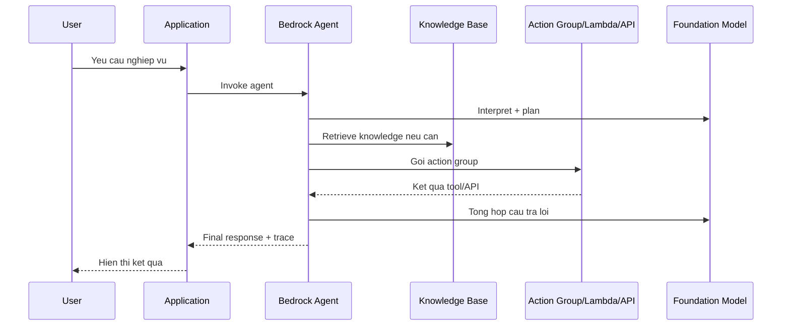

# Amazon Bedrock Guideline For Generative AI

Amazon Bedrock la dich vu managed cua AWS de xay dung ung dung generative AI
bang foundation models, RAG, agents, guardrails, model customization, monitoring
va cost optimization ma khong can tu quan ly ha tang model serving.

Tai lieu nay tap trung vao cach hieu Bedrock trong kien truc thuc te: app goi
LLM nhu the nao, data di vao dau, Knowledge Bases lay du lieu ra sao, va can
quan tri security/cost/observability nhu the nao.

## Core Capabilities

| Capability | Dung khi nao |
|---|---|
| Model inference | Goi model de chat, summarize, extract, classify, generate code/text/image |
| Converse API | Chuan hoa chat/multi-turn qua nhieu model trong Bedrock |
| InvokeModel API | Goi model truc tiep khi can request body rieng cua provider |
| Knowledge Bases | RAG voi du lieu doanh nghiep tren S3, database, vector store |
| Agents | Cho LLM lap ke hoach, goi tool/action group, truy van knowledge base |
| Guardrails | Loc noi dung, bao ve chinh sach, giam rui ro hallucination/sensitive data |
| Model customization | Fine-tuning/customization khi prompt/RAG chua du |
| Batch inference | Xu ly offline voi latency linh hoat va chi phi tot hon on-demand |
| Monitoring | CloudWatch metrics, CloudTrail, invocation logging, S3/CloudWatch Logs |

## High-Level Architecture



## Bedrock Lay LLM O Dau?

Bedrock khong bat ban tu host model. Ung dung goi Bedrock Runtime, sau do
Bedrock route request den foundation model da chon. Model co the den tu nhieu
provider khac nhau, vi du Amazon Nova/Titan, Anthropic Claude, Meta, Mistral,
Cohere, DeepSeek, OpenAI va cac provider khac tuy region/model availability.

Chon model nen dua tren:

- Chat/reasoning/code/image/audio hay embedding.
- Context window va kha nang xu ly tai lieu dai.
- Latency va throughput.
- Gia input token/output token.
- Region duoc ho tro.
- Yeu cau compliance va data residency.
- Chat luong thuc te tren evaluation dataset cua ung dung.

## Bedrock Lay Data Nhu The Nao?

Co 4 pattern chinh:

### 1. Prompt-Only

Ung dung tu lay data tu database/API cua minh, sau do dua context vao prompt.



### 2. Knowledge Bases For RAG

Bedrock Knowledge Bases ket noi data source, tao embedding, luu vao vector
store, sau do retrieve doan lien quan khi co cau hoi. Ket qua retrieve duoc dua
vao model de tao cau tra loi va co the kem citation.



### 3. Agents

Bedrock Agents phu hop khi request can nhieu buoc: hieu y dinh, lap ke hoach,
goi tool, doc knowledge base, sau do tong hop ket qua.



### 4. Batch Inference

Dung cho job offline: summarize hang loat, classify document, enrich dataset.
Khong nen dung realtime API cho workload khong can realtime neu batch dap ung
duoc SLA.

## API Selection

| API/Interface | Khi dung |
|---|---|
| `Converse` / `ConverseStream` | Chat, multi-turn, streaming, format thong nhat qua model |
| `InvokeModel` / `InvokeModelWithResponseStream` | Can payload rieng cua model/provider |
| OpenAI-compatible APIs | Khi dung model/API duoc Bedrock ho tro theo interface OpenAI |
| `Retrieve` | Ung dung tu build prompt sau khi lay context tu Knowledge Base |
| `RetrieveAndGenerate` | De Knowledge Base retrieve va goi model sinh cau tra loi |
| Agent runtime | Khi can planning, tool calling, workflow nhieu buoc |

## Basic Converse Example

```python
import boto3

client = boto3.client("bedrock-runtime", region_name="us-east-1")

response = client.converse(
    modelId="anthropic.claude-opus-4-7",
    messages=[
        {
            "role": "user",
            "content": [{"text": "Explain Amazon Bedrock in 3 bullet points."}],
        }
    ],
    inferenceConfig={
        "maxTokens": 512,
        "temperature": 0.2,
    },
)

print(response["output"]["message"]["content"][0]["text"])
```

Note: model ID va region thay doi theo model availability. Luon kiem tra model
duoc enable trong account/region truoc khi deploy.

## Security Best Practices

- Dung IAM least privilege: backend chi duoc goi model/KB/agent can thiet.
- Khong goi Bedrock truc tiep tu browser neu lam lo credential.
- Tach role cho inference, ingestion, admin, va monitoring.
- Ma hoa data source, vector store, log, va output bang KMS neu can.
- Khong log prompt/output chua PII neu chua co masking va retention policy.
- Dung VPC endpoints/private networking khi workload yeu cau network isolation.
- Dung Guardrails cho use case public, regulated, hoac noi dung rui ro cao.
- Audit bang CloudTrail va review quyen truy cap model dinh ky.

## Cost Best Practices

Bedrock cost phu thuoc vao provider, model, modality, region, service tier, input
tokens, output tokens, batch/on-demand, provisioned throughput, Knowledge Bases,
Guardrails, evaluation va cac tinh nang lien quan.

Checklist:

- Chon model nho/nhanh cho task don gian; chi dung model lon cho task can
  reasoning/chat luong cao.
- Dat `maxTokens` va validate response length.
- Giam prompt thua, conversation history thua, va retrieved chunks khong lien
  quan.
- Cache system prompt, prompt prefix, hoac response lap lai khi co the.
- Dung batch inference cho job offline; AWS pricing page ghi batch inference cho
  mot so FM co gia thap hon on-demand.
- Theo doi cost theo project/team/user bang tags, IAM principal, hoac Cost and
  Usage Report.
- Tao budget rieng cho Bedrock va alert theo service.
- Dung evaluation de tranh tra tien cho model dat tien nhung khong cai thien
  ket qua.

## Observability

Nen theo doi:

| Metric/Log | Muc dich |
|---|---|
| Request count | Biet luu luong va spike |
| Input/output tokens | Du bao cost va toi uu prompt |
| Latency | SLA va trai nghiem nguoi dung |
| Throttling/error rate | Phat hien quota/capacity issue |
| Model ID | So sanh cost/quality giua model |
| User/project/tenant | Chargeback/showback |
| Guardrail intervention | Do rui ro noi dung va false positive |
| Retrieval hit rate | Danh gia RAG co lay dung context khong |

AWS ho tro CloudWatch metrics, CloudTrail logging va model invocation logging
cho `bedrock-runtime`. Neu bat invocation logging, can co chinh sach bao mat vi
prompt va output co the chua du lieu nhay cam.

## RAG Design Best Practices

- Chia tai lieu theo semantic chunk, khong chi cat cung theo so ky tu.
- Luu metadata: source, version, owner, ngay cap nhat, permission scope.
- Dung permission filtering neu moi user chi duoc xem mot phan tai lieu.
- Test retrieval rieng truoc khi test final answer.
- Dung reranking khi top-k retrieval co nhieu nhieu.
- Hien citation/source de nguoi dung kiem chung.
- Co data freshness policy: sync theo lich, event-driven, hoac manual approval.
- Xoa/re-index document khi source thay doi de tranh tra loi tu du lieu cu.

## System Design Checklist

- [ ] Co backend orchestration layer, khong de client goi LLM truc tiep.
- [ ] Co prompt template versioning.
- [ ] Co input validation va output validation.
- [ ] Co retry/backoff cho throttling va transient errors.
- [ ] Co timeout va fallback model/response.
- [ ] Co cache neu query lap lai.
- [ ] Co evaluation dataset cho quality, safety, latency, cost.
- [ ] Co budget va dashboard rieng cho GenAI workload.
- [ ] Co guardrails va logging policy.
- [ ] Co runbook xu ly: latency tang, cost tang, hallucination, retrieval sai.

## Production Flow From A To Z

1. Xac dinh use case va risk: chat noi bo, customer support, document QA, agent.
2. Chon data pattern: prompt-only, RAG, agent, batch, fine-tuning.
3. Chon model candidate theo quality, latency, cost, region.
4. Tao evaluation dataset gom cau hoi that va expected behavior.
5. Thiet ke prompt template, system instruction, output schema.
6. Neu RAG: ingest data, chunk, embed, index, test retrieval.
7. Them guardrails, authZ, permission filtering, va PII handling.
8. Build backend API goi Bedrock Runtime/KB/Agent.
9. Ghi metrics: request, token, latency, error, model, tenant.
10. Dat budget, anomaly detection, va dashboard.
11. Chay load test va quality evaluation.
12. Release theo canary/feature flag.
13. Review cost/quality hang tuan va toi uu prompt/model/retrieval.

## Official References

- [Amazon Bedrock overview](https://docs.aws.amazon.com/bedrock/latest/userguide/what-is-bedrock.html)
- [Amazon Bedrock product page](https://aws.amazon.com/bedrock/)
- [Amazon Bedrock pricing](https://aws.amazon.com/bedrock/pricing/)
- [Amazon Bedrock Knowledge Bases](https://docs.aws.amazon.com/bedrock/latest/userguide/knowledge-base.html)
- [Monitor the bedrock-runtime endpoint](https://docs.aws.amazon.com/bedrock/latest/userguide/monitoring.html)

