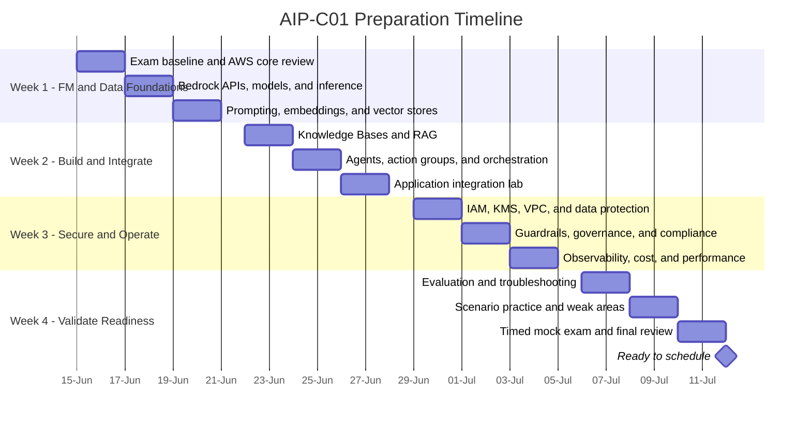

# AWS Certified Generative AI Developer - Professional Study Plan

**Exam:** AIP-C01  
**Plan dates:** June 15-July 12, 2026  
**Assumption:** 2-3 focused hours each weekday, with a longer Saturday lab or
practice session.

The official exam is 180 minutes with 75 questions: 65 scored and 10 unscored.
The minimum passing score is 750 on a 100-1,000 scale.

## Exam Domain Weights

| Domain | Weight |
|---|---:|
| 1. Foundation Model Integration, Data Management, and Compliance | 31% |
| 2. Implementation and Integration | 26% |
| 3. AI Safety, Security, and Governance | 20% |
| 4. Operational Efficiency and Optimization for GenAI Applications | 12% |
| 5. Testing, Validation, and Troubleshooting | 11% |

## Four-Week Timeline

## Weekly Outcomes

### Week 1: Foundation Models and Data

- Compare foundation models by modality, context window, latency, quality, and
  cost.
- Use Amazon Bedrock model invocation APIs and understand streaming responses.
- Explain prompt templates, inference parameters, embeddings, chunking, and
  vector similarity search.
- Review core AWS services that support GenAI workloads: IAM, Amazon S3,
  AWS Lambda, Amazon API Gateway, Amazon CloudWatch, and AWS KMS.
- Complete one small model-invocation lab and record baseline latency and cost.

### Week 2: Implementation and Integration

- Design a RAG workflow using Amazon Bedrock Knowledge Bases.
- Compare vector-store choices and choose chunking, metadata, retrieval, and
  reranking strategies.
- Build an Amazon Bedrock Agent with instructions, an action group, and a
  knowledge base.
- Handle sessions, conversation context, retries, quotas, and failures.
- Integrate a GenAI workflow with Lambda, API Gateway, Step Functions, S3, SQS,
  or EventBridge where appropriate.

### Week 3: Safety, Security, and Operations

- Apply least-privilege IAM, encryption with KMS, secrets management, and
  network isolation.
- Explain data residency, sensitive-data handling, logging risks, and the AWS
  shared responsibility model.
- Configure Amazon Bedrock Guardrails and distinguish safeguards from model
  evaluation and application authorization.
- Monitor token usage, latency, throttling, errors, and business-level quality.
- Compare cost and performance tradeoffs such as model choice, prompt size,
  caching, provisioned throughput, and asynchronous processing.

### Week 4: Testing and Exam Readiness

- Evaluate factuality, relevance, toxicity, robustness, latency, and cost using
  representative datasets.
- Diagnose retrieval, prompt, model, permissions, quota, and integration
  failures systematically.
- Complete scenario-based questions in proportion to the official domain
  weights.
- Take one uninterrupted 180-minute mock exam.
- Review every incorrect or uncertain answer and map it to an exam-guide task.

## Daily Study Loop

1. Read the relevant AIP-C01 exam-guide tasks.
2. Study one concept and summarize its design tradeoffs.
3. Build or inspect one small AWS example.
4. Answer 10-20 scenario questions.
5. Add mistakes and unclear topics to a review log.

## Readiness Gate

Schedule the exam when all of these are true:

- You score at least 80% on two timed practice sets.
- You can explain why each incorrect option is wrong, not only why one option
  is correct.
- No exam domain is below 70%.
- You can design and troubleshoot a secure RAG or agentic solution without
  relying on memorized diagrams.
- You can finish a full mock exam with at least 20 minutes remaining.

## Official References

- [AWS Certified Generative AI Developer - Professional](https://aws.amazon.com/certification/certified-generative-ai-developer-professional/)
- [AIP-C01 Exam Guide](https://docs.aws.amazon.com/aws-certification/latest/ai-professional-01/ai-professional-01.html)
- [Amazon Bedrock User Guide](https://docs.aws.amazon.com/bedrock/latest/userguide/what-is-bedrock.html)

_Exam details and domain weights verified against AWS documentation on
June 13, 2026._
